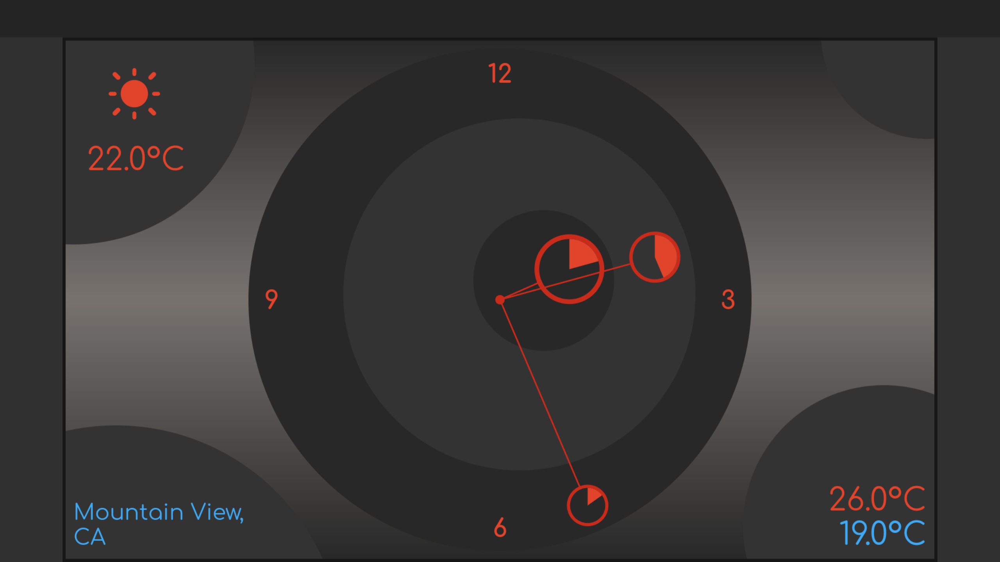

# Flutter Clock

Welcome to Flutter Clock!

See [flutter.dev/clock](https://flutter.dev/clock) for how to get started, submission requirements, contest rules, and FAQs.
<!-- 
See a [live demo](https://maryx.github.io/flutter_clock) with Flutter for Web! -->

Example [Analog Clock](analog_clock)

<video src='analog_clock/analog_light.mp4' width='350'></video>
<video src='analog_clock/analog_dark.mp4' width='350'></video>
 

 

 
